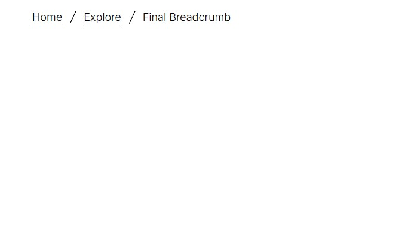
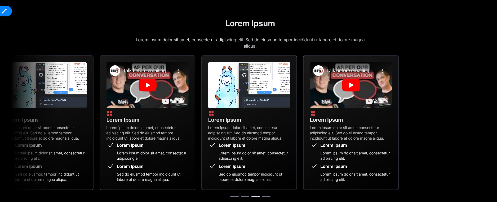

<!-- TODO: Create instructions for linking the tailwind config with the dependent's tailwind config -->

<!-- TODO: Add instructions for importing the minified tailwind classes from this project -->

<!-- TODO: Add instructions for importing style.css into your layout.tsx for app routing -->

<!-- TODO: DON'T CROSS THE STREAMS! be careful not to include conflicting classes in your tailwind configration -->

# SSW Consulting Component Library

A React component library built with TypeScript, Next.js, and Shadcn/UI, providing customizable UI components for web applications.

## Installation

- run the following command to install the npm package

```bash
npm install ssw-tinacms-landingkit
```

- add an import at the top of `app/layout.tsx` `import "ssw-tinacms-launchkit/dist/style.css";`
- for example usage of the components visit: `tina-starter\app\posts\explore\[...filename]\client-page.tsx`

#### Schema configuration

- for example schema configurations see: `tina-starter\tina\collections\post.tsx`

#### Adding Inter fonts (Recommended)

These components were designed with Inter fonts in, so it's recommended that you use Inter in your project.
Please note that you can import and apply inter fonts at varying scopes in your project. In this example we're
configuring the full application to use it inside of `app/layout.tsx`

```tsx
//import inter fonts
import { Inter } from 'next/font/google';

//configure inter font variants
const inter = Inter({
  variable: '--inter-font',
  subsets: ['latin'],
  display: 'swap',
  weight: ['200', '300', '400', '500', '600', '700'],
});

export default function RootLayout({
  children,
}: {
  children: React.ReactNode;
}) {
  //apply inter fonts to full application
  return (
    <html lang='en' className={`${inter.className}`}>
      <body
        style={{
          margin: '3rem',
        }}>
        <main>{children}</main>
      </body>
    </html>
  );
}
```

## Features

- 🎨 Customizable theming and styling
- 📱 Responsive design
- 🔧 TypeScript support
- ⚡ Next.js compatible
- 🎯 TinaCMS integration for content management

## Requirements

- React 18 or higher
- TailwindCSS
<!-- remove this from the requirements? -->
- Next.js 13 or higher
- TypeScript 4.5 or higher

## Components

| Component Name | Preview Image                                   |
| -------------- | ----------------------------------------------- |
| LogoCarousel   |  |
| Breadcrumbs    |     |
| CardCarousel   |  |

### Documentation

- [Breadcrumbs](_docs/Breadcrumbs.md)
- [Logo Carousel](_docs/LogoCarousel.md)
- [Card Carousel](_docs/CardCarousel.md)

### Styling

The component scan be manually styled by applying tailwind classes to the components themselves using the `className` property.
For conflicting tailwind classes or styling that cannot be configured by appending styles to the
outer component each component inludes input props. This can include classes defined in your tailwind
config file.

## Contributing

### Local Testing

#### Previewing Components

- run the following at the root of the project `pnpm link --global`
- navigate to the root of the test project `cd tina-starter`
- link test project with the component package by running `pnpm link --global ssw-tinacms-landingkit`
- install all dependencies and run the project by running `pnpm i` and then `pnpm dev`
- check you can view the components at `http://localhost:3000/admin/index.html#/~/posts/explore/HelloWorld`

#### Testing Customizations

- rebuild the components with your customizations by running `pnpm run build`
- If you've already linked the repo using the steps outlined in `Previewing components` you should be able to see your changes

#### Publishing New versions

- Update the version number in `package.json` using [Semver](https://semver.org/)
  - This should indicate whether the change MAJOR, MINOR, or a PATCH
- Merge any new changes into the `master` branch to prevent snowflake npm publications
  - **Note**: you do not need to merge changes to `/dist` into main
- rebuild the package with your changes by running `pnpm build`
- run `npm publish --public`
- when prompted to log into npm Navigate to **Keeper** and use the one time authentication code

## License

MIT License

#### Troubleshooting

- Q: 'tailwindcss' is not recognized as an internal or external command
  - A: you need to have tailwind installed on your machine. You can fix this by running npm i --global tailwindcss

### Known Issues

- The "cardGuidList" for the CardCarousel schema must have a default configured or you will not be able to add new queries without erros.
