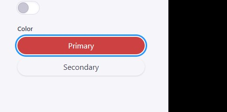

# SSW Consulting Component Library

A React component library built with TypeScript, Next.js, and Shadcn/UI, providing customizable UI components for web applications.

## Installation

1. run the following command to install the npm package

```bash
npm install ssw-tinacms-landingkit
```

2. import and use any of the templates into your `tina/config.ts` file

```tsx
//replace with the React icons you want to use
import * as AntIcons from "../../node_modules/react-icons/ai";
import {
  breadcrumbBlock,
  buttonBlock,
  cardCarouselBlock,
  imageTextBlock,
  logoCarouselBlock,

  // replace this with a relative path node modules directory (See known issues)
} from "../../node_modules/ssw-tinacms-landingkit/dist";

export default defineConfig({
  // ...
  schema: {
    collections: [
      {
        label: "<your-collection-label>",
        name: "<post>",
        path: "<your-path>",
        fields: [
          // ... other fields
          {
            //...
            fields: [
              {
                type: "object",
                list: true,
                label: "<your label>",
                name: "blocks",
                ui: {
                  visualSelector: true,
                },
                templates: [
                  // include the schema definitions for the components you want to use
                  breadcrumbBlock(
                    "https://github.com/SSWConsulting/SSW.TinaCMS.LandingKit/blob/master/tina-starter/public/tina/previews/breadcrumbs.jpg?raw=true"
                  ),
                  logoCarouselBlock(
                    "https://github.com/SSWConsulting/SSW.TinaCMS.LandingKit/blob/master/tina-starter/public/tina/previews/logo-carousel.png?raw=true?raw=true"
                  ),
                  buttonBlock({
                    icons: AntIcons,
                    previewSrc:
                      "https://github.com/SSWConsulting/SSW.TinaCMS.LandingKit/blob/master/tina-starter/public/tina/previews/button.png?raw=true",
                  }),
                  cardCarouselBlock({
                    icons: AntIcons,
                    previewSrc:
                      "https://github.com/SSWConsulting/SSW.TinaCMS.LandingKit/blob/master/tina-starter/public/tina/previews/card-carousel.jpg?raw=true",
                  }),
                  imageTextBlock({
                    icons: AntIcons,
                    previewSrc:
                      "https://github.com/SSWConsulting/SSW.TinaCMS.LandingKit/blob/master/tina-starter/public/tina/previews/image-text-block.png?raw=true",
                  }),
                  accordionBlock({
                    icons: AntIcons,
                    previewSrc:
                      "https://github.com/SSWConsulting/SSW.TinaCMS.LandingKit/blob/master/tina-starter/public/tina/previews/accordion.png?raw=true",
                  }),
                ],
              },
            ],
          },
        ],
      },
    ],
  },
});
```

3. import the component styling into your `app/layout.tsx` file (import component styling before app styling)

```tsx
import "ssw-tinacms-landingkit/dist/style.css";

export default function RootLayout({
  children,
}: {
  children: React.ReactNode;
}) {
  return (
    <html>
      <body>{children}</body>
    </html>
  );
}
```

4. Define and use a blocks component in your page

- For more information refer to the TinaCMS documentation on [block based editing](https://tina.io/docs/editing/blocks)

```tsx
import React from "react";
// replaced with the react-icons you want to use
import * as AntIcons from "react-icons/ai";
import {
  Breadcrumbs,
  Button,
  CardCarousel,
  ImageTextBlock,
  LogoCarousel,
} from "ssw-tinacms-landingkit";

export const Blocks = (props: Pages) => {
  return (
    <>
      {props.blocks ? (
        props.blocks.map(function (block, i) {
          switch (block.__typename) {
            case "<outer-schema>BlocksLogoCarousel":
              return <LogoCarousel repeat={10} data={block} />;
            case "<outer-schema>BlocksBreadcrumbs":
              return (
                <Breadcrumbs
                  data={{
                    ...block,
                    //URL segment mapping is configured outside of the schema
                    breadcrumbReplacements: [
                      {
                        from: "explore",
                        to: "Explore",
                      },
                    ],
                    firstBreadcrumb: "Home",
                  }}
                />
              );
            case "<outer-schema>BlocksCardCarousel":
              return (
                <CardCarousel
                  icons={AntIcons}
                  callbackFunctions={callbackFunctions}
                  data={block}
                />
              );
            case "<outer-schema>BlocksButton":
              return (
                <Button
                  icons={AntIcons}
                  callbackFunctions={callbackFunctions}
                  data={block}
                />
              );
            case "<outer-schema>BlocksImageTextBlock":
              return (
                <ImageTextBlock
                  icons={AntIcons}
                  callbackFunctions={callbackFunctions}
                  data={block}
                ></ImageTextBlock>
              );
            case "<outer-schema>BlocksAccordion":
              return (
                <Accordion
                  icons={AntIcons}
                  callbackFunctions={callbackFunctions}
                  data={block}
                ></Accordion>
              );
            default:
              return <></>;
          }
        })
      ) : (
        <></>
      )}
    </>
  );
};
```

### Components

For more information on how to use the components see the following links:

- [Logo Carousel](_docs/components/LogoCarousel.md)
- [Breadcrumbs](_docs/components/Breadcrumbs.md)
- [CardCarousel](_docs/components/CardCarousel.md)
- [CardCarousel (stacked layout)](_docs/components/CardCarousel.md)
- [Button](_docs/components/Button.md)
- [Icon Picker Input](_docs/components/IconPickerInput.md)
- [Color Picker Input](_docs/components/ColorPickerInput.md)
- [Image Text Block](_docs/components/ImageTextBlock.md)
- [Accordion Block](_docs/components/Accordion.md)

#### Schema configuration

- for example schema configurations see: `tina-starter\tina\collections\post.tsx`

#### Adding Inter fonts (Recommended)

These components were designed with Inter fonts in, so it's recommended that you use Inter in your project.
Please note that you can import and apply inter fonts at varying scopes in your project. In this example we're
configuring the full application to use it inside of `app/layout.tsx`

```tsx
//import inter fonts
import { Inter } from "next/font/google";

//configure inter font variants
const inter = Inter({
  variable: "--inter-font",
  subsets: ["latin"],
  display: "swap",
  weight: ["200", "300", "400", "500", "600", "700"],
});

export default function RootLayout({
  children,
}: {
  children: React.ReactNode;
}) {
  //apply inter fonts to full application
  return (
    <html lang="en" className={`${inter.className}`}>
      <body
        style={{
          margin: "3rem",
        }}
      >
        <main>{children}</main>
      </body>
    </html>
  );
}
```

## Features

- 🎨 Customizable theming and styling
- 📱 Responsive design
- 🔧 TypeScript support
- ⚡ Next.js compatible
- 🎯 TinaCMS integration for content management

## Requirements

- React 18 or higher
- TailwindCSS 3.4.17
<!-- remove this from the requirements? -->
- Next.js 13 or higher
- TypeScript 4.5 or higher
- React Icons 5.0 or higher

## Components

| Component Name                | Preview Image                                                  |
| ----------------------------- | -------------------------------------------------------------- |
| Logo Carousel                 |                 |
| Breadcrumbs                   |                    |
| CardCarousel                  |                 |
| CardCarousel (stacked layout) |  |
| Button                        |                              |
| Icon Picker Input             |         |
| Color Picker Input            |        |
| Image Text Block              |            |
| Accordion                     |                        |

### Styling

The component scan be manually styled by applying tailwind classes to the components themselves using the `className` property.
For conflicting tailwind classes or styling that cannot be configured by appending styles to the
outer component each component inludes input props. This can include classes defined in your tailwind
config file.

## Contributing

### Local Testing

#### Previewing Components

- build the project and install all dependencies at the root of the project by running `pnpm build` and then `pnpm i`
- run the following at the root of the project `pnpm link --global`
- navigate to the root of the test project `cd tina-starter`
- link test project with the component package by running `pnpm link --global ssw-tinacms-landingkit`
- install all dependencies and run the project by running `pnpm i` and then `pnpm dev`
- check you can view the components at `http://localhost:3000/admin/index.html#/~/posts/explore/HelloWorld`

#### Testing Customizations

- rebuild the components with your customizations by running `pnpm run build`
- If you've already linked the repo using the steps outlined in `Previewing components` you should be able to see your changes

#### Publishing New versions

- Update the version number in `package.json` using [Semver](https://semver.org/)
  - This should indicate whether the change MAJOR, MINOR, or a PATCH
- Merge any new changes into the `master` branch to prevent snowflake npm publications
  - **Note**: you do not need to merge changes to `/dist` into main
- rebuild the package with your changes by running `pnpm build`
- run `npm publish --public`
- when prompted to log into npm Navigate to **Keeper** and use the one time authentication code

## License

MIT License

#### Troubleshooting

- Q: 'tailwindcss' is not recognized as an internal or external command
  - A: you need to have tailwind installed on your machine. You can fix this by running npm i --global tailwindcss

### Known Issues

- The "cardGuidList" for the CardCarousel schema must have a default configured or you will not be able to add new queries without erros.
- The schema definitions only work when using relative imports
- When using custom tailwind classes in your project they may conflict with the classes used in the component library
